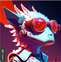

## Welcome to RPGGO zone 👋

### 🙋‍♀️What is RPGGO.AI?
We define RPGGO as a generative AI pownered interaction platform - the next generation game engine. wow🌈

### 🧙 Who we are?

Check our profile if you want to make friend with us

| Team Members  | |
| ------------- | ------------- |
|   [Lei Zhang](https://www.linkedin.com/in/codingtmd/)   Full stack Eng| Content Cell  |
| Content Cell  | Content Cell  |

<!--

**Here are some ideas to get you started:**

🙋‍♀️ A short introduction - what is your organization all about?
🌈 Contribution guidelines - how can the community get involved?
👩‍💻 Useful resources - where can the community find your docs? Is there anything else the community should know?
🍿 Fun facts - what does your team eat for breakfast?
🧙 Remember, you can do mighty things with the power of [Markdown](https://docs.github.com/github/writing-on-github/getting-started-with-writing-and-formatting-on-github/basic-writing-and-formatting-syntax)
-->
